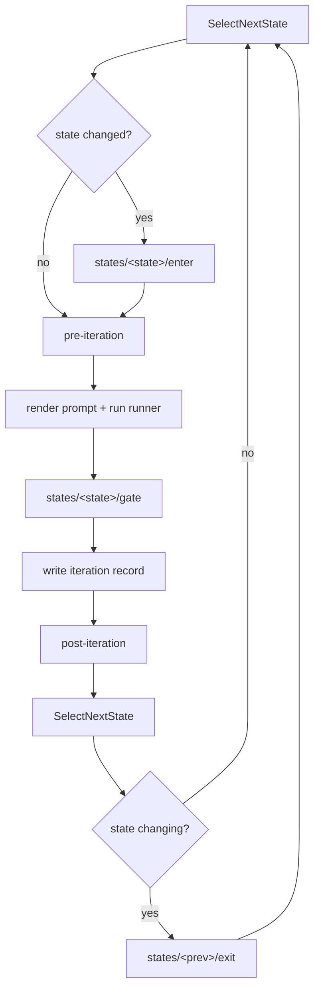

# Hooks

Hooks are executable scripts under `.ralph/hooks/`. Any language; just `chmod +x`. Ralph invokes them with `cwd = repo root` and a stable env.

## Layout

```
.ralph/hooks/
├── pre-iteration       # global: runs before every iteration
├── post-iteration      # global: runs after every iteration
├── failure             # global: runs when FSM enters `failed`
└── states/
    ├── clean/{enter,exit,gate}
    ├── dirty/{enter,exit,gate}
    ├── revert/{enter,exit,gate}
    └── review/{enter,exit,gate}
```

Names are single verbs (`enter`, `exit`, `gate`) — not `on_enter`/`on_exit`.

## Lifecycle per iteration



## Hook contracts

| Hook                            | Input              | Exit semantics                                                                          |
|---------------------------------|--------------------|-----------------------------------------------------------------------------------------|
| `pre-iteration`                 | env only           | Non-zero → skip iteration; log stderr.                                                  |
| `post-iteration`                | iteration JSON on stdin | Exit ignored.                                                                       |
| `failure`                       | env: `RALPH_FAILURE_MODE`, `RALPH_FAILURE_REASON` | Exit ignored. React to OOM / rate-limit / terminal.   |
| `states/<state>/enter`          | env only           | Non-zero → log warning, continue.                                                       |
| `states/<state>/exit`           | env: `RALPH_NEXT_STATE` | Non-zero → log warning, continue.                                                  |
| `states/<state>/gate`           | env only           | Exit 0 = pass, non-zero = fail. Result surfaces in `{{.GateResult}}` for next prompt. With `[gate] soft_fail=true` (default) the FSM stays out of `failed` on regression. |

Missing hooks are fine — every slot has a no-op default.

## Environment

Always set:

- `RALPH_REPO` — absolute path to the repo root.
- `RALPH_ITER` — current iteration number (1-indexed).
- `RALPH_STATE` — current state name.
- `RALPH_PREV_STATE` — previous state name (empty on first iteration).
- `RALPH_PROMPT_FILE` — path to the rendered prompt file for this iteration.
- `RALPH_ITER_JSON` — path to the per-iteration JSON record once written.

Conditional:

- `RALPH_NEXT_STATE` — exit hooks only.
- `RALPH_FAILURE_MODE` / `RALPH_FAILURE_REASON` — failure hook only.
- `RALPH_REVIEW_BRANCH` / `RALPH_REVIEW_BASE` — review states only.

## What hooks should and shouldn't do

**Should**: run tests (`gate`), notify Slack on transitions (`post-iteration`), bump a marker file (`enter`), sync external comments into bd findings (`enter` for `review`).

**Shouldn't**: alter FSM state, write to `state/fsm.json` directly, parse the prompt and try to re-route. The FSM is closed-core; routing is the orchestrator's job.

## Testing a hook manually

```
ralph hook run .ralph/hooks/states/clean/gate
```

Sets the env vars from the current `state/fsm.json` and runs the hook with the same `cwd` the orchestrator uses. Output goes to your terminal.
