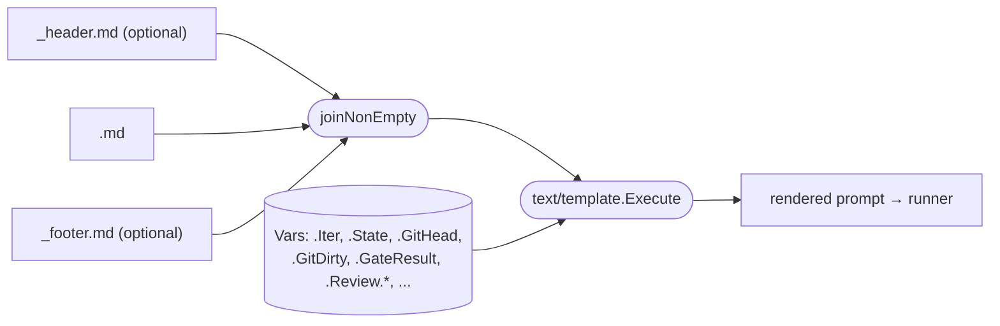

# Prompts

Each state has a markdown prompt at `.ralph/prompts/<state>.md`. Rendered with Go `text/template`. Optional `_header.md` and `_footer.md` wrap every state's prompt — the final order is **`_header → <state> → _footer`**.

## Composition



Implementation: `internal/promptlib/promptlib.go`. The composed string is parsed once per iteration with `Option("missingkey=error")` — referencing an undefined variable fails the render rather than silently producing `<no value>` in the wrong spot.

## Template variables

| Variable             | Meaning                                                                           |
|----------------------|-----------------------------------------------------------------------------------|
| `.Iter`              | Current iteration number (1-indexed).                                             |
| `.State`             | Current state name.                                                               |
| `.PrevState`         | Previous state (empty on first iteration).                                        |
| `.GitDirty`          | bool — true if working tree has uncommitted tracked changes.                      |
| `.GitHead`           | Short SHA of HEAD.                                                                |
| `.RepoRoot`          | Absolute path to the repo root.                                                   |
| `.LastIter`          | Map of the previous iteration's summary record (state, narrative, commits, …).   |
| `.GateResult`        | Last gate-hook outcome: `passed`, `failed`, or `not-run`.                         |
| `.Review.Branch`     | Branch under review (review states only).                                         |
| `.Review.Base`       | Base branch for the review.                                                       |
| `.Review.OpenFindings` | Integer count of open `review:<branch>` findings.                               |

## The `include` helper

```
{{include "_shared/safety-rules.md"}}
```

Reads the file *relative to `.ralph/prompts/`* and substitutes its rendered contents. Lets you keep one source of truth for snippets reused across prompts. Climbs above the prompts/ directory (`../`) are rejected; absolute paths are rejected.

## Composition order

For state `clean`:

```
.ralph/prompts/_header.md            ← prepended (optional)
.ralph/prompts/clean.md              ← state body
.ralph/prompts/_footer.md            ← appended (optional)
```

`_header.md` and `_footer.md` are themselves templated with the same variables.

## Conventions

- **Header**: introduce the project, set the agent's mental model for the repo, declare invariants (paths, module name, language). Keep under 200 words.
- **State body**: the iteration-specific instruction. What to look at, what decision to make. The agent already knows the workflow — keep this lean.
- **Footer**: the workflow steps (`bd memories` → `bd ready` → claim → implement → close) plus safety rules. This is where the 12-step workflow lives.

## Rendering for debugging

```
ralph prompt show clean         # render with current FSM state vars
ralph prompt show review        # uses .Review.* vars from fsm.json
```

Prints the final composed text — same string that would be sent to the runner.

## Live editing

Templates are read from disk at the top of every iteration, so editing
`.ralph/prompts/` mid-run takes effect on the next tick — no restart, no
watcher, and the iteration in flight is unaffected (its prompt was already
rendered). The loop hashes the prompt directory each iteration and prints a
notice when anything changed:

```
ralph: prompts changed since last iteration (clean.md, _header.md) — reloaded
```

Every regular file under the root counts, not just `<state>.md` — an
`{{include}}`d snippet is as much a prompt as the state body is.

## Capture

Every iteration's *fully rendered* prompt is saved at `.ralph/state/logs/iter-NNNN-<ts>-prompt.txt`. Lets you reconstruct what the agent was actually asked even after templates evolve.
