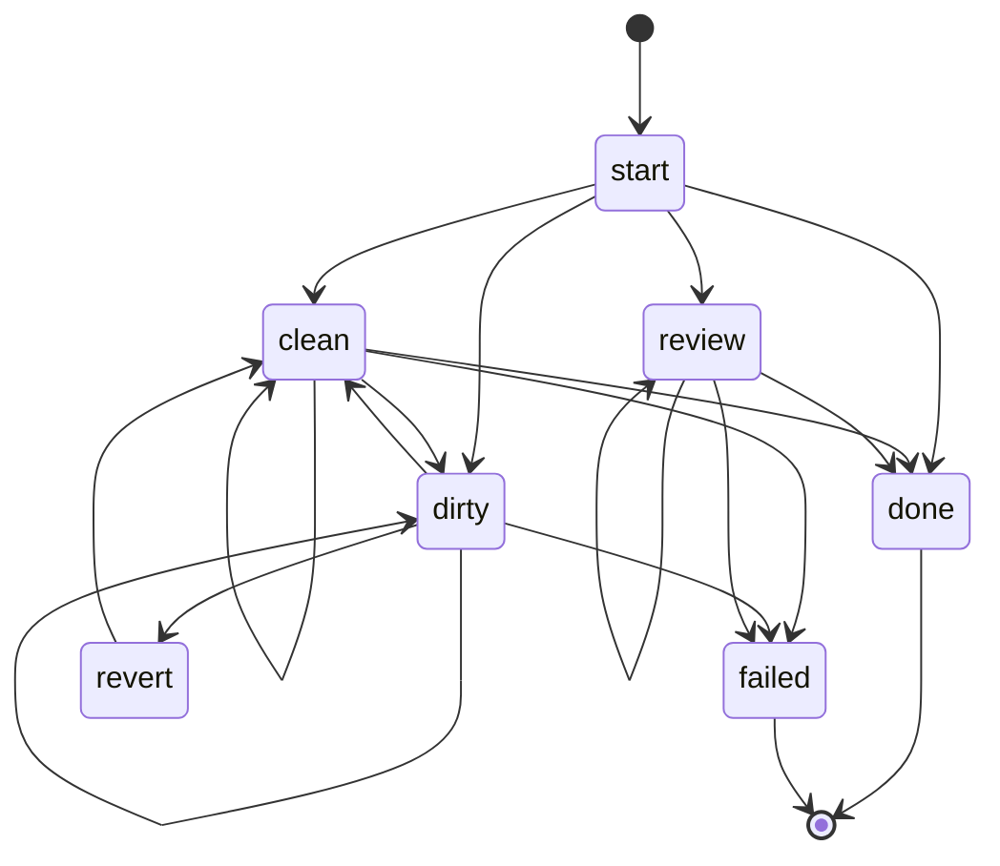

# State machine

The FSM is defined in `internal/fsm/`. Topology is fixed in the binary; `.ralph/` customizes prompts and hooks per state, never the topology.

## Topology



Render this against a real run with `ralph fsm graph` — that overlays observed edge counts from `transitions.jsonl`.

## States

| State            | Kind     | What it means                                                                              |
|------------------|----------|--------------------------------------------------------------------------------------------|
| `start`          | initial  | First iteration; immediately calls `selectNextState`.                                       |
| `clean`          | loop     | Working tree clean, draining `bd ready`.                                                    |
| `dirty`          | loop     | Working tree dirty; assess & finish or accumulate streak.                                   |
| `revert`         | one-shot | Auto-revert triggered (3 consecutive dirty iterations); `git checkout -- .` + `bd defer`. Suppressed in review mode. |
| `review`         | loop     | Review-mode loop; agent decides ingest / fix / address-gate / file-merge per iteration.    |
| `done{Reason}`   | terminal | Exit 0. Reasons: `QueueEmpty` (nothing left to do), `IterCap` (max iterations reached), `Idle` (too many consecutive no-op iterations). |
| `failed{Reason}` | terminal | Exit 1. Reasons: `Budget`, `Auth`, `RunnerTerminal`. Runs `hooks/failure`.                 |

There is no `idle` *state* — `done{idle}` is a terminal reason, not a state. A state with no prompt and no hook is just a function call wearing a hat — routing is centralized in `selectNextState`.

## Routing

After every iteration, `fsm.SelectNextState(ctx, in)` evaluates predicates in order and returns the next `Outcome`. Real source: `internal/fsm/select.go`. The eight-step decision tree:

```
1. RunnerFailure ∈ {auth, budget, runner_terminal}  -> failed{<reason>}
2. BudgetExhausted                                  -> failed{budget}
3. CapsExceeded                                     -> done{iter_cap}
4. ReviewMode:
     if ReviewQueueEmpty && GitClean                -> done{queue_empty}
     else                                           -> review
5. DirtyStreakExceeded                              -> revert
6. GitDirty                                         -> dirty
6.5 NoopStreak >= MaxNoopIters (>0)                 -> done{idle}
7. bd_ready==0 && bd_in_progress==0 && GitClean     -> done{queue_empty}
8. otherwise                                        -> clean
```

`RunnerFailure` is a `fsm.Reason` — the loop maps `internal/runner.Mode` (auth, budget, dead_session-after-threshold) to a Reason before calling `SelectNextState`. This keeps `internal/fsm` independent of `internal/runner`.

Notes on ordering:

- **Failures first.** Terminal runner failure and budget exhaustion always win.
- **Caps before review/run.** A graceful exit on `max_iterations` takes precedence over re-entering a loop state.
- **`done` requires `git_clean`.** Prevents exiting with uncommitted work.
- **Review uses label-scoped queue.** Otherwise an unrelated empty global queue would terminate review mid-stream.

## Predicates

All predicates are pure Go functions in `internal/fsm/predicates.go`:

- `GitClean(ctx, repo)` / `GitDirty(ctx, repo)` — working-tree status, excluding untracked. Thin wrappers over `internal/git.Clean`.
- `BDReadyCount(ctx, bd, label)` — `len(bd ready -l <label> --json)`. Empty label = unscoped.
- `BDInProgressCount(ctx, bd, label)` — `len(bd list --status in_progress -l <label> --json)`.
- `ReviewQueueEmpty(ctx, bd, branch)` — `BDReadyCount(_, "review:"+branch) == 0 && BDInProgressCount(_, "review:"+branch) == 0`.
- `DirtyStreakExceeded(fsm, cfg)` — `fsm.ConsecutiveDirty >= cfg.Backoff.DirtyRevertThreshold` (zero threshold disables).
- `CapsExceeded(fsm, cfg)` — `fsm.Iter >= cfg.Loop.MaxIterations` (zero disables).
- `BudgetExhausted(fsm, cfg)` — cost or wallclock cap exceeded (zero disables each).

Terminal runner failure is *not* a predicate — it's a `fsm.Reason` the loop passes into `RouteInput.RunnerFailure` after classifying the runner session via `internal/runner.Classify`.

## Counters

In `internal/fsm/counters.go`. The loop calls `ObserveTransition(next)` *before* mutating `f.State`, so the "from" side reads the current state:

- `iter` increments once per loop iteration (`BumpIter`).
- `consecutive_dirty` increments on `* → dirty`, resets on `* → clean` or `* → revert`. Other transitions leave it unchanged.

## Persistence

`state/fsm.json` records: schema version, current state + reason, counters, review fields, cumulative cost/wallclock, last gate result. Survives orchestrator restarts. `ralph run` resumes from it unless `--fresh` is passed. Writes are atomic (temp-in-same-dir + fsync + rename) and schema-versioned — a newer file is rejected with `fsm.ErrSchemaTooNew`.

## The review state carries its own routing logic

The single `review` state covers ingest, fix, gate-fail, and merge-filing through one prompt — the agent decides which based on `{{.Review.OpenFindings}}`, `{{.GateResult}}`, and the diff. The FSM does not break review into sub-states because per-iteration context lets the agent route itself, and a single state stays grep-able.

See [.ralph/prompts/review.md](../../.ralph/prompts/review.md) for the routing the agent performs.
